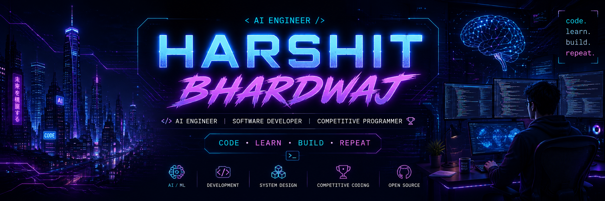

<p align="center">
  
</p>

<h1 align="center">
  Hi 👋 I'm Harshit Bhardwaj
</h1>

<h3 align="center">
Software Developer • AI/ML Enthusiast • Competitive Programmer
</h3>

<p align="center">
  
</p>

---

<div align="center">

### 🚀 *Code • Learn • Build • Repeat*

</div>

---

<table>

<tr>

<td width="58%" valign="top">

# 👨‍💻 About Me

```cpp
class Harshit
{
public:

    string role = "Software Developer";

    vector<string> languages =
    {
        "C++",
        "Python",
        "Java",
        "SQL"
    };

    vector<string> interests =
    {
        "Artificial Intelligence",
        "Machine Learning",
        "Backend Development",
        "System Design"
    };

    string currently =
        "Building AI Projects & Solving LeetCode";

    string funFact =
        "Turning coffee into code ☕";
};
```

### 🌱 Currently Working On

- 🔥 Solving LeetCode Daily
- 🤖 Building AI Projects
- ⚡ Learning System Design
- 📚 Exploring LLMs & GenAI
- 🌍 Contributing to Open Source

</td>

<td width="42%" align="center">


</td>

</tr>

</table>

---

# ⚡ Tech Arsenal

<div align="center">


</div>

---

# 🔥 GitHub Streak

<div align="center">


</div>

---

# 📈 Most Used Languages

<div align="center">


</div>

---

# 🚀 Featured Projects

<table>

<tr>

<td width="33%" align="center">

## 📄 DocuMind

AI-powered document understanding and question answering system.

**Tech Stack**

Python • FastAPI • NLP • Transformers

<a href="https://github.com/HarshitB6/DocuMind">
View Project →
</a>

</td>

<td width="33%" align="center">

## 🤖 AI Chatbot

Conversational AI chatbot powered by modern LLM APIs.

**Tech Stack**

Python • LLM • FastAPI

<a href="https://github.com/HarshitB6/ai-chatbot">
View Project →
</a>

</td>

<td width="33%" align="center">

## 🧠 AI Hallucination Checker

Detects hallucinated responses generated by LLMs.

**Tech Stack**

Python • NLP • Machine Learning

<a href="https://github.com/HarshitB6/ai-hallucination-checker">
View Project →
</a>

</td>

</tr>

</table>

---

# 🎯 Current Focus

- 🚀 Building AI Applications
- 💻 Solving LeetCode Daily
- 📚 Learning Advanced Machine Learning
- ⚡ Mastering System Design
- 🌍 Open Source Contributions

---

# 🌐 Connect With Me

<p align="center">

<a href="https://github.com/HarshitB6">

</a>

<a href="https://linkedin.com/in/harshit--bhardwaj">

</a>

</p>

---

<div align="center">

### ⭐ Thanks for visiting my profile!

*"First, solve the problem. Then, write the code."*

</div>
---

# 🐍 Contribution Snake

<p align="center">


</p>
