<div align="center">

# `harshit@github ~$`


</div>

```bash
harshit@github ~$ ./contributions.sh
```



```bash
harshit@github ~$ whoami
```



```bash
harshit@github ~$ cat about.md
```

I am **Harshit Bhardwaj**, a Computer Science student at **Bharati Vidyapeeth College of Engineering** graduating in **2028**. I enjoy building systems where clean backend engineering meets practical AI, and I am currently focused on turning student projects into polished, recruiter-friendly products.

I care most about backend systems that feel dependable, AI features that solve real problems, and projects that show deliberate engineering rather than just surface-level demos.

```bash
harshit@github ~$ ls interests/
```

<p>
  
  
  
  
</p>

```bash
harshit@github ~$ stack --show
```

<p>
  
</p>

```bash
harshit@github ~$ cat focus.txt
```

- Building stronger fundamentals in data structures, algorithms, and problem solving
- Creating reliable backend services with clear APIs and maintainable architecture
- Exploring practical AI systems that are useful beyond demos

```bash
harshit@github ~$ tree featured-projects/
```

- **DocuMind**: AI-powered document understanding and assistance workflows, currently being shaped into a polished product experience.
- **AI Chatbot**: Conversational AI experiments focused on retrieval, reasoning quality, and usability.
- **AI Hallucination Checker**: Reliability tooling for spotting weak or unsupported model responses during evaluation.

```bash
harshit@github ~$ cat goals.txt
```

- Ship polished portfolio projects that demonstrate engineering depth
- Contribute consistently on GitHub while improving code quality and velocity
- Earn a software engineering internship and keep compounding real-world experience

```bash
harshit@github ~$ git stats
```

<div align="center">
  
</div>

<div align="center">
  
</div>

<div align="center">
  
</div>

```bash
harshit@github ~$ ./activity-graph --live
```


```bash
harshit@github ~$ connect --list
```

<p>
  <a href="https://github.com/HarshitB6"></a>
  <a href="https://github.com/HarshitB6?tab=repositories"></a>
</p>

```bash
harshit@github ~$ echo $STATUS
```

> Building thoughtfully. Learning aggressively. Aiming for impact.
>>>>>>> a598f22 (Revamp GitHub profile with animated SVGs)
